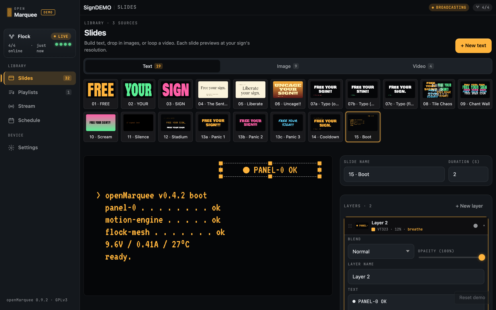
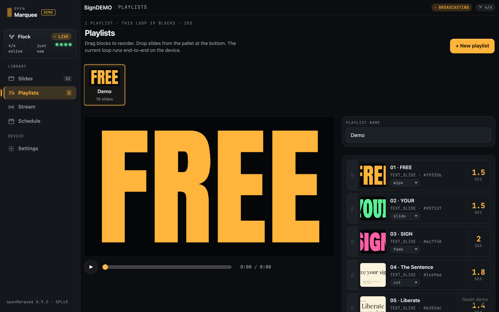
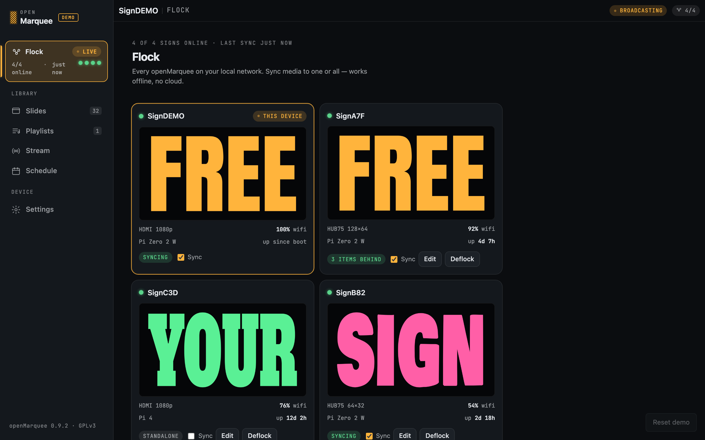

# openMarquee

**Escape vendor lock-in. Run your sign yourself.**

  <a href="https://openmarquee.com"><b>🌐 openmarquee.com</b></a>
  &nbsp;&nbsp;·&nbsp;&nbsp;
  <a href="https://openmarquee.com/demo/"><b>▶️ Try the live demo</b></a>
  &nbsp;&nbsp;·&nbsp;&nbsp;
  <a href="CHANGELOG.md"><b>📋 Changelog</b></a>

Every commercial LED sign ships locked to its vendor's software — usually
Windows-only, often abandonware, sometimes a $10–30/month cloud subscription with
your content held hostage. openMarquee is an open-source, self-contained controller
you flash onto a Raspberry Pi that lets you drive the same hardware from any phone,
with no app, no account, no internet, no subscription.

The device boots into its own WiFi network. You connect your phone, a captive portal
opens in your browser, and you upload videos, images, and text slides. Playback runs
on the device; your content stays on your SD card.

**No Pi yet?** The [live demo](https://openmarquee.com/demo/) runs the actual device
dashboard in your browser against a mock backend — build a playlist, try the editor,
see the motion effects, no hardware required.

## Screenshots

### The editor

Drop in slides, stack layers, dial in motion and blend modes — every change
previews at your sign's exact resolution.

### Playlists

Drag to reorder, set a transition and a duration per slide; the loop runs
end-to-end on the device.

### Flock

Every openMarquee on your network in one view — sync media to one sign or all
of them, offline.

## Features

### Slides — five kinds of content

- **Text** — typeset text slides with fonts, colors, and sizing.
- **Image** — drop in stills.
- **Video** — loop a clip, hardware-decoded on the device (V4L2 H.264).
- **Stream** — take over the sign with a live WebRTC feed from your phone's camera.
- **Web** — point a slide at any URL; the device renders the live page.

### Editor — no app, no install

- **Captive-portal dashboard** that opens in any phone's browser; nothing to install.
- **Layered compositing** — text over video, text over image.
- **Six text-motion animations** — breathe, pulse, bounce, shake, blink, and ticker
  (plus static).
- **Four layer blend modes** — normal, screen, multiply, overlay.
- **Sixteen slide transitions** — cut, fade, wipe, slide, iris, scroll, flip,
  marquee, dissolve, pixelate, halftone, scanline, glitch, push, blinds, and
  shutter — each with an adjustable duration.
- Built as **vanilla JavaScript** — no framework, just `esbuild` + `vitest`.

### Display & rendering engine

- **HDMI output** to any TV, monitor, or HDMI-input sign.
- **Rust shader compositor** — single-pass EGL + GLES2 + dmabuf renderer over
  DRM/KMS atomic, with no desktop environment.
- **Smooth 30 fps**, continuously monitored against a strict per-frame paint
  budget (≤ 33 ms).

### Networking & access — your network, your rules

- **First-boot captive portal** — the device creates its own WiFi access point;
  connect from a phone, set a password, configure the playlist.
- **Per-device AP password** generated at first boot — no shared default baked
  across flashed images.
- **Optional WiFi prefill at flash time** — bake in home WiFi credentials and the
  device boots straight onto the network.
- **Operator password** with bearer-token auth protecting the dashboard.
- **Optional [Tailscale](https://tailscale.com)** for secure remote access from
  anywhere, at zero ongoing cost.

### Self-contained by design

- **No cloud, no account, no subscription, no internet required.**
- Content stored as **plain JSON + asset files on the SD card** — no database.
- Heavy video decode and scaling run **client-side via `ffmpeg.wasm`**, keeping the
  device itself cheap.

## Status

**v0.6.0-beta** (DELETE-PIL purge, 2026-05-17). The Python rendering subsystem is
gone; the Rust IPC sidecar at `renderer/` is the only production rendering path.
Release-candidate work continues; the first tagged GitHub release lands after the
§11 soak gate fires and the operator quickstart docs land. Primary target is the
**Raspberry Pi Zero 2 W**.

## Architecture

A Raspberry Pi Zero 2 W runs **Python FastAPI** for the auth / playlist / IPC
orchestration backend, a **Rust sidecar binary** for the HDMI render path (EGL +
GLES2 + dmabuf single-pass shader compositor over DRM/KMS atomic, with V4L2 H.264
decode for video slides), and a **vanilla-JS browser dashboard** served from the
device for the captive-portal editor. Content lives as JSON + asset files on the SD
card; there is no database.

## What's NOT in v0.6.0-beta

An honest list of gaps so nobody is surprised:

- **HUB75 LED matrix output** — not supported on HEAD. The Python HUB75 renderer was
  deleted in the DELETE-PIL purge; the Rust sidecar is HDMI-only at this release.
  Rust LED outputs are planned for a follow-up arc.
- **WS2812B LED strip output** — same shape as HUB75: awaiting the Rust port.
- **Composite (NTSC/PAL) video output** — not implemented. Post-v1.
- **AI background generation** — runtime generation deferred; pre-generated
  backgrounds ship in the seed content.
- **Flock management UI** — multi-device cross-sync is scoped and partially
  implemented (peer discovery, manifest exchange, and the pull worker exist; the
  operator-facing onboarding UI does not).
- **Hardware compatibility matrix** — Pi Zero 2 W is the verified target; Pi 4 / Pi 5
  validation is deferred.
- **Tagged release artifact** — the SD-card image build is functional, but a tagged
  release with a sha256-verified flashable image ships in a later slice.

## Repository layout

- [`backend/`](backend/) — FastAPI app that runs on the device (auth, playlist, IPC
  orchestration of the renderer sidecar).
- [`renderer/`](renderer/) — Rust sidecar binary for the HDMI render path.
- [`ui/`](ui/) — browser-based dashboard (editor + playlist + settings + Stream).
- [`system/`](system/) — device OS config (hostapd, dnsmasq, systemd units,
  captive-portal glue, firstboot oneshot).
- [`scripts/`](scripts/) — build / deploy / soak harnesses.
- [`docs/`](docs/) — contributor-facing design + spec docs.
- [`qa/captures/`](qa/captures/) — phase-level audit notes.

## Documentation

- **Spec-of-record:** [`docs/renderer-rewrite-requirements.md`](docs/renderer-rewrite-requirements.md)
  — read this before changing render contracts.
- **Changelog:** [`CHANGELOG.md`](CHANGELOG.md) · **Contributing:** [`CONTRIBUTING.md`](CONTRIBUTING.md)

> Install / first-boot quickstart docs land in the next doc slice.

## License

GPLv3 — see [`LICENSE`](LICENSE).
